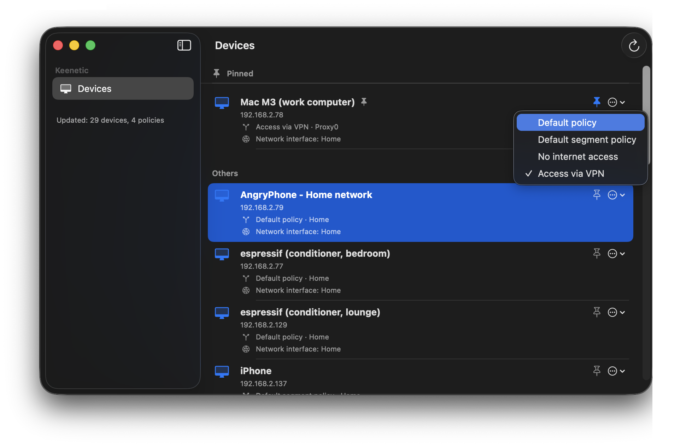
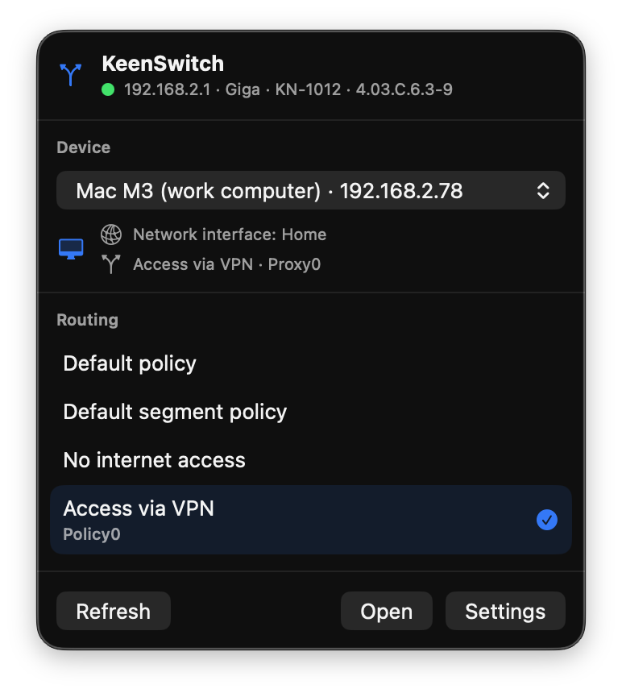

# KeenSwitch

[](https://github.com/Bayrakovsky/KeenSwitch/actions/workflows/ci.yml)
[](LICENSE)
[](#requirements)

macOS menu bar app for switching **IP routing policies** on Keenetic routers — without opening the web interface.

Select a device, pick a policy (Default, VPN, No Internet, …), done.

| Main window | Menu bar |
|:-----------:|:--------:|
|  |  |

---

## Requirements

- **macOS 14 Sonoma** or later
- Keenetic router running **KeeneticOS 3.x** or later
- **Network Policy** component installed on the router  
  *(System Components → Network Policy)*

## Supported routers

Any Keenetic router running KeeneticOS 3.x with the Network Policy component. Tested on:

| Series | Models |
|--------|--------|
| Giga | KN-1010, KN-1011, KN-1012 |
| Ultra | KN-1810, KN-1811 |
| Viva | KN-1912 |
| Giant | KN-2610 |
| Peak | KN-2710 |
| Hero 4G / 4G+ | KN-2310, KN-2311 |
| Duo | KN-2111 |
| City | KN-1510, KN-1511 |
| Extra | KN-1710, KN-1711, KN-1713, KN-1714 |
| Air | KN-1610, KN-1611, KN-1613 |
| Lite | KN-1310, KN-1311 |

If your model is not listed but runs KeeneticOS 3.x with the Network Policy component — it should work too.

## Features

- See all devices on the network with their current routing policy
- Switch any device to a different policy in two clicks
- Quick access from the **menu bar** — no need to open the main window
- Auto-refresh when network connection is restored
- Launch at login with optional **silent start** (menu bar only, no Dock icon)
- Built-in **auto-update** from GitHub Releases
- Interface in **English and Russian**

## Installation

1. Download **`KeenSwitch-vX.Y.Z-macOS.zip`** from [Releases](https://github.com/Bayrakovsky/KeenSwitch/releases)
2. Unzip and drag **KeenSwitch.app** to **Applications**
3. On first launch macOS may block an unsigned app — right-click → **Open** → **Open**

Or remove the quarantine flag via Terminal:

```bash
xattr -cr /Applications/KeenSwitch.app && open -a KeenSwitch
```

## Setup

**On the router:** make sure the Network Policy component is installed  
*(Keenetic web interface → System Components → Network Policy → Install)*

**In KeenSwitch:** open **Settings → Connection** and enter:
- Router address — the same URL you use in the browser (e.g. `192.168.1.1`,
  `http://192.168.1.1:8080`, or your KeenDNS name). Pasting a full browser URL is
  fine — the scheme, port, and trailing slash are parsed automatically.
- Admin username and password
- Enable HTTPS if your router requires it

### A note on HTTPS

KeenSwitch validates TLS certificates like a browser does. This matters for **how you reach the router**:

- **KeenDNS name** (e.g. `yourname.keenetic.link`) — has a valid certificate, so HTTPS just works.
- **Local IP** (e.g. `192.168.1.1`) — Keenetic routers usually serve HTTPS there with a
  **self-signed** certificate, which is rejected (you'll see a *TLS error*). On your home
  network use **HTTP** for the local IP, or switch to the KeenDNS name for HTTPS.

KeenSwitch does **not** accept untrusted certificates — this is deliberate, so a
man-in-the-middle on your network can't intercept the router password.

## Build from source

Requires **Xcode 16** and macOS 14+.

```bash
git clone https://github.com/Bayrakovsky/KeenSwitch.git
cd KeenSwitch
open KeenSwitch.xcodeproj
# Product → Run  ⌘R
```

## Contributing

Bug reports, feature requests, and PRs are welcome — see [CONTRIBUTING.md](CONTRIBUTING.md)
for how to set up a dev environment, run the tests, and submit changes.
Release history lives in [CHANGELOG.md](CHANGELOG.md). All participants are expected
to follow the [Code of Conduct](CODE_OF_CONDUCT.md).

## Security

Found a vulnerability? Please **don't** open a public issue — see
[SECURITY.md](SECURITY.md) for how to report it privately.

## License

MIT — see [LICENSE](LICENSE).
